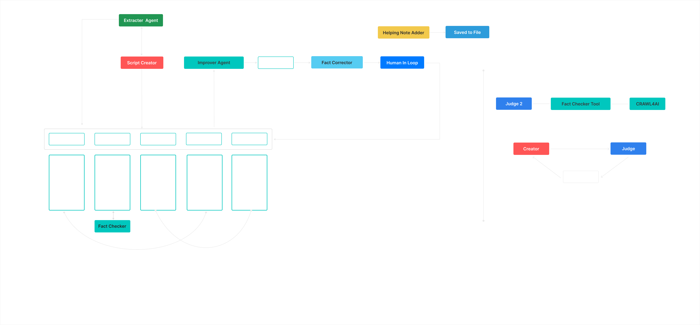

# PUBLIC_SPEAKING_AGENT
An Agent that:
1. Writes Scripts for You
2. Improves the Script using Automated Judge Critique
3. Presents you the Script and Improves it Based upon Your Feedback

In Progress:
1. Building Dynamic Agent Workflows with Custom Prompt and Functions. Allows the Agent to build Effective Execution Flows based upon User Prompt. Each Execution Flow (Sequence of Runnign Tools and Sub Agents) is built by the LLM specifically aligning to the User's Prompt. As per research Current Agentic Frameworks do not provide this feature uptill now, atleast. 
2. Implementing Long-Term and Short Term Memory for Better handling Prompts with Past Event Refrences
3. Giving the LLM Realtime Context during the Execution of the Flow so it can handle Egde Cases and Interrupts Easily.

The FrameWork Diagram:

Create a .env file and place in all the locations mentioned below:

-- Custom Agent Folder
--- Custom_Agent Folder
--- Docling Folder
--- In Each Sub Agent Folder in sub_agents

Put the following key in .env file

GOOGLE_API_KEY= "YOUR KEY"

How to Run the Code?

Just Run the Custom_Agent_Main.py File.
I have placed a readymade prompt for you (in Custom_Agent_Main.py) and a supporting document to go along with it. 

